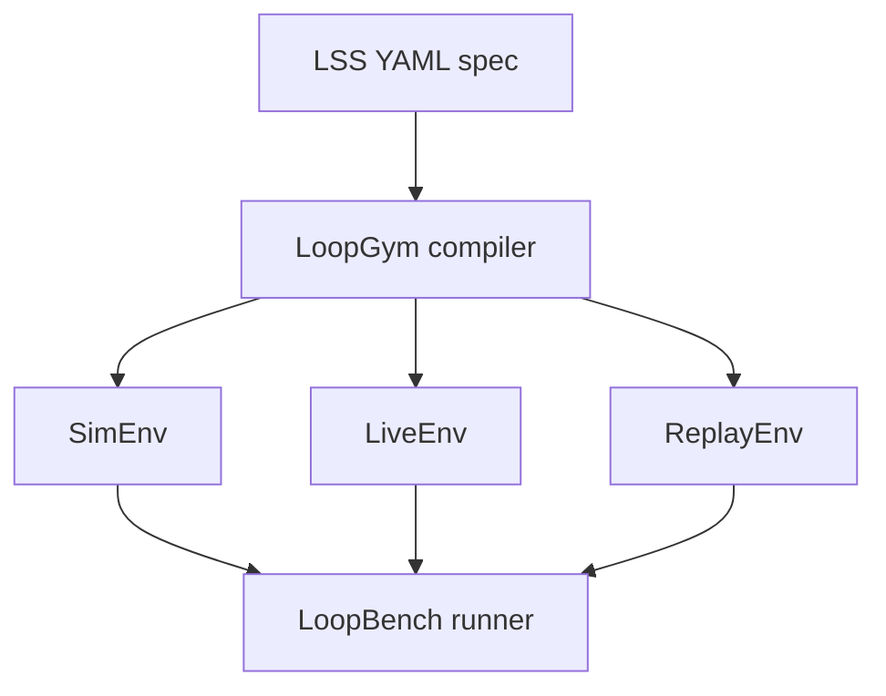

<p align="center">
  <strong>LoopGym</strong><br>
  <em>OpenAI Gym for self-improving loops.</em>
</p>

<p align="center">
  <a href="https://github.com/KanakMalpani/LoopGym/actions/workflows/test.yml"></a>
  <a href="LICENSE"></a>
  
  <a href="https://github.com/KanakMalpani/Loop-Core-Engineering"></a>
  
</p>

---

If **LSS** is how you *declare* a loop, **LoopGym** is how you *run* it.

LoopGym compiles [LSS 1.0](https://github.com/KanakMalpani/Loop-Core-Engineering) YAML into executable environments — with deterministic simulation for CI, live model backends for production eval, and trajectory replay from [LoopNet](https://github.com/KanakMalpani/loopnet). One API. Three backends. Zero vendor lock-in on the spec.

```python
import loopgym as lg

env = lg.make("loopbench/code-repair-v1")
obs = env.reset(task_id="cr-001")
while not env.done:
    obs, reward, done, info = env.step(agent.action(obs))
```

<p align="center">
  <a href="#-install--run"><strong>Install & run →</strong></a> ·
  <a href="docs/api.md">API reference</a> ·
  <a href="examples/quickstart.py">Quickstart script</a>
</p>

---

## Why LoopGym

| Problem | LoopGym answer |
|---------|----------------|
| Every benchmark rolls its own runner | Shared `loopgym.make(env_id)` registry |
| CI can't afford API keys | **SimEnv** — deterministic, free, fast |
| Production eval needs real models | **LiveEnv** — pluggable backends |
| Historical analysis burns budget | **ReplayEnv** — LoopNet trajectories, no LLM calls |

[LoopBench](https://github.com/KanakMalpani/LoopBench) defines tasks and scores them; LoopGym executes. Clean separation, like Gym vs. benchmark suites in RL.

---

## Architecture



---

## ⚡ Install & run

**One-liner (GitHub):**

```bash
pip install git+https://github.com/KanakMalpani/LoopGym.git
python -c "import loopgym as lg; env = lg.make('loopbench/code-repair-v1'); print(env.reset(task_id='cr-001'))"
```

**Developer setup:**

```bash
git clone https://github.com/KanakMalpani/LoopGym.git && cd LoopGym
pip install -e ".[dev]"
python examples/quickstart.py
pytest tests/ -q
```

**PyPI** (after first release — [PUBLISHING.md](PUBLISHING.md)):

```bash
pip install loopgym
```

---

## Environments

| Env ID | Backend | Use case |
|--------|---------|----------|
| `loopbench/code-repair-v1` | SimEnv | Verify-driven code repair |
| `loopbench/research-synthesis-v1` | SimEnv | Research brief synthesis |
| `loopbench/multi-agent-debate-v1` | SimEnv | Multi-agent review / debate |
| `replay/loopnet-v1` | ReplayEnv | Replay [LoopNet](https://github.com/KanakMalpani/loopnet) trajectories |
| `sim/mock-llm-v1` | SimEnv | Generic mock-LLM sandbox |

Bundled LSS specs live under [`envs/loopbench/`](envs/loopbench/). All validated against [Loop Core Engineering](https://github.com/KanakMalpani/Loop-Core-Engineering) in CI.

---

## LoopNet replay (optional)

```bash
git clone https://github.com/KanakMalpani/loopnet.git ../loopnet
# or: export LOOPNET_SEED_PATH=/path/to/records.jsonl
```

```python
env = lg.make("replay/loopnet-v1")
env.reset(record_id="ln-00042")
```

---

## Ecosystem

| Repository | Role |
|------------|------|
| [Loop Core Engineering](https://github.com/KanakMalpani/Loop-Core-Engineering) | LSS / LES authority |
| [LoopNet](https://github.com/KanakMalpani/loopnet) | Trajectory corpus |
| **LoopGym** | Runtime (this repo) |
| [LoopBench](https://github.com/KanakMalpani/LoopBench) | Benchmark orchestration |

Full stack map: [ECOSYSTEM.md](https://github.com/KanakMalpani/Loop-Core-Engineering/blob/main/ECOSYSTEM.md)

---

## Project layout

| Path | Purpose |
|------|---------|
| [`loopgym/`](loopgym/) | Registry, envs, runtime, evaluators |
| [`envs/loopbench/`](envs/loopbench/) | Task fixtures + LSS specs |
| [`docs/api.md`](docs/api.md) | API reference |
| [`examples/quickstart.py`](examples/quickstart.py) | Onboarding smoke test |

---

## Citation

```bibtex
@software{loopgym2026,
  title={LoopGym: OpenAI Gym for LSS-Defined Agent Loops},
  author={Malpani, Kanak},
  year={2026},
  url={https://github.com/KanakMalpani/LoopGym}
}
```

---

<p align="center">
  <sub>MIT · v0.1 · <a href="CONTRIBUTING.md">Contributing</a> · <a href="SECURITY.md">Security</a> · <a href="PUBLISHING.md">PyPI</a></sub>
</p>
