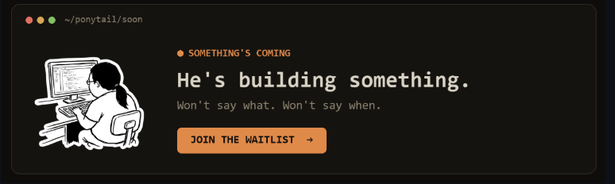
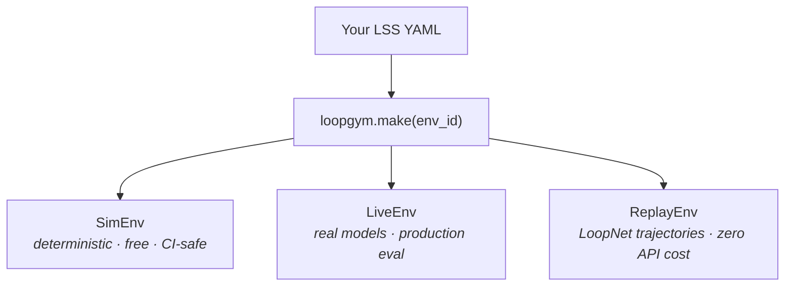
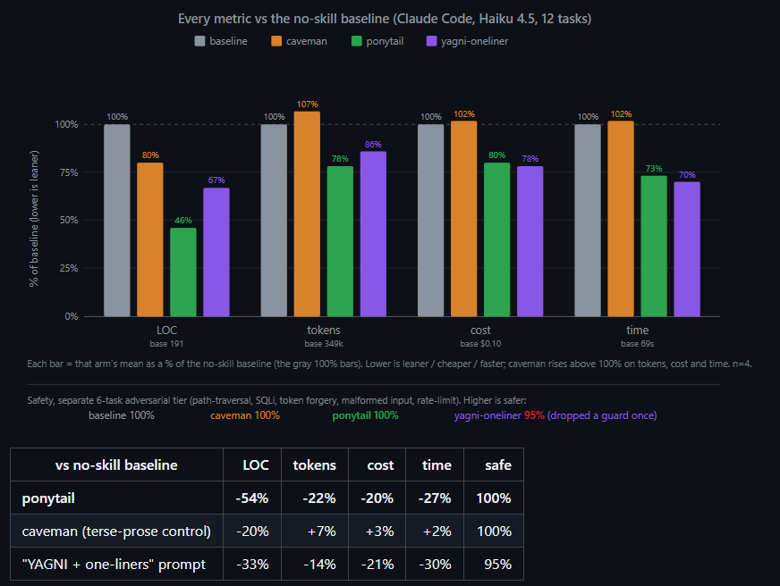

<div align="center">



# LoopGym

**Run any loop. Three ways. One API.**

Compile [LSS 1.1](https://github.com/KanakMalpani/Loop-Core-Engineering) YAML into executable environments — simulate for CI, call live models for production eval, or replay [LoopNet](https://github.com/KanakMalpani/loopnet) trajectories without spending a token.

<br>

[](https://github.com/KanakMalpani/LoopGym/actions/workflows/test.yml)
[](https://pypi.org/project/loopgym/)
[](LICENSE)
[](https://www.python.org/downloads/)
[](https://github.com/KanakMalpani/Loop-Core-Engineering)

<br>

```bash
pip install loopgym
```

<br>

[**Quickstart**](#try-it-in-60-seconds) · [**API docs**](docs/api.md) · [**PyPI**](https://pypi.org/project/loopgym/) · [**LoopBench**](https://github.com/KanakMalpani/LoopBench) · [**Observability**](https://github.com/KanakMalpani/loop-observability)

</div>

---

## 🚀 The idea in one picture



**LSS declares the loop. LoopGym runs it.** [LoopBench](https://github.com/KanakMalpani/LoopBench) scores it. Clean separation — like Gym vs. benchmark suites in reinforcement learning.

---

## 📊 The "Ponytail" Efficiency Dividend

By structuring your systems into formal closed loops with **LoopForge** and **LoopGym**, and applying optimal "ponytail" style compiler compression, you shed token bloat, latency, and costs while remaining 100% safe.

<div align="center">
  
  <p><i>Every metric vs the no-skill baseline (Claude Code, Haiku 4.5, 12 tasks)</i></p>
</div>

### Metrics vs. No-Skill Baseline

| Strategy | Lines of Code (LOC) | Token Usage | API Cost | Latency (Time) | Safety |
| :--- | :---: | :---: | :---: | :---: | :---: |
| **ponytail** (Optimal Loop) | **-54%** | **-22%** | **-20%** | **-27%** | **100%** |
| **caveman** (Terse Prose) | -20% | +7% | +3% | +2% | 100% |
| **YAGNI + One-Liners** | -33% | -14% | -21% | -30% | 95% |

---

## ⚡ Three backends, one line of code

```python
import loopgym as lg

env = lg.make("loopbench/code-repair-v1")
obs = env.reset(task_id="cr-001")

while not env.done:
    action = your_agent.policy(obs)
    obs, reward, done, info = env.step(action)
```

| Backend | When to use | API keys? |
|---------|-------------|-----------|
| **SimEnv** | CI, local dev, [LoopBench](https://github.com/KanakMalpani/LoopBench) submissions | No |
| **LiveEnv** | Production eval with real LLMs | `OPENAI_API_KEY` (pluggable) |
| **ReplayEnv** | Analyze historical runs from LoopNet | No |

---

## 🛠️ Try it in 60 seconds

```bash
pip install loopgym

python -c "
import loopgym as lg
env = lg.make('loopbench/code-repair-v1')
obs = env.reset(task_id='cr-001')
print('task:', obs.task_id, '| step:', obs.step)
"
```

**Full quickstart:**

```bash
git clone https://github.com/KanakMalpani/LoopGym.git && cd LoopGym
pip install -e ".[dev]"
python examples/quickstart.py
pytest tests/ -q
```

---

## 📈 Validate and reproduce

Ran a replay or SimEnv episode? Follow [REPRODUCE.md](https://github.com/KanakMalpani/Loop-Engineering/blob/main/contributions/REPRODUCE.md) and post on [Discussion #10](https://github.com/KanakMalpani/Loop-Engineering/discussions/10). Export trajectories via [loopnet COMMUNITY-SUBMISSION](https://github.com/KanakMalpani/loopnet/blob/main/guides/COMMUNITY-SUBMISSION.md).

---

## 🗺️ Environments (v0.1.3)

| Env ID | Backend | Stress-tests / Perturbations |
|--------|---------|--------------|
| `loopbench/code-repair-v1` | Sim | Verify-driven repair, iteration limits |
| `loopbench/research-synthesis-v1` | Sim | Multi-step synthesis + rubric |
| `loopbench/multi-agent-debate-v1` | Sim | Role-separated workers + evaluator |
| `loopbench/composed-swarm-v1` | Sim | Composed parallel rehearsal ([scenario-swarm-rehearsal](https://github.com/KanakMalpani/Loop-Engineering/blob/main/loop-library/compositions/scenario-swarm-rehearsal.yaml)) — LB-COMP-1 |
| `loopbench/rag-retrieval-v1` | Perturbed Sim | RAG retrieval with missing/stale source perturbations — LB-RAG-1 |
| `loopbench/hitl-gate-v1` | Perturbed Sim | Human-in-the-loop approval gate simulation (rejections) — LB-HITL-1 |
| `loopbench/safety-constrained-v1` | Perturbed Sim | Tool allowlist / denylist safety termination — LB-SAFE-1 |
| `replay/loopnet-v1` | Replay | Full trajectories from [LoopNet v0.2](https://huggingface.co/datasets/KanakMalpani/loopnet-v0.2) |
| `sim/mock-llm-v1` | Sim | Generic sandbox for custom LSS specs |

Bundled specs under [`envs/loopbench/`](envs/loopbench/) — validated against [Loop Core Engineering](https://github.com/KanakMalpani/Loop-Core-Engineering) in CI.

---

## 🎯 Who this is for

| You want to… | LoopGym gives you… |
|--------------|-------------------|
| **Benchmark your loop design** | Same env IDs [LoopBench](https://github.com/KanakMalpani/LoopBench) uses |
| **Test without burning API budget** | SimEnv + ReplayEnv |
| **Ship production eval pipelines** | LiveEnv with pluggable backends |
| **Replay production-like runs** | ReplayEnv + [LoopNet corpus](https://github.com/KanakMalpani/loopnet) |
| **Trace iterations & LES** | [`loopotel`](https://github.com/KanakMalpani/loop-observability) LTF export |

---

## 👁️ Observability

Trace loop iterations without raw chat logs ([LTF 0.1](https://github.com/KanakMalpani/loop-observability)):

```bash
pip install loopotel loopgym
python -c "
import loopgym as lg
from loopotel.integrations.loopgym import run_traced_episode
env = lg.make('loopbench/code-repair-v1')
result, trace = run_traced_episode(env, task_id='cr-001', seed=0, enabled=True)
print(result['success'], len(trace['spans']), 'spans')
"
```

Full stack walkthrough: [LoopNet end-to-end tutorial](https://github.com/KanakMalpani/loopnet/blob/main/guides/END-TO-END-TUTORIAL.md).

---

## ⚙️ Ecosystem

| Repo | Role |
|------|------|
| [Loop Core Engineering](https://github.com/KanakMalpani/Loop-Core-Engineering) | LSS / LES authority |
| [LoopNet](https://github.com/KanakMalpani/loopnet) | Trajectory corpus |
| **LoopGym** | Runtime (this repo) |
| [LoopBench](https://github.com/KanakMalpani/LoopBench) | Public scoreboard |
| [loop-observability](https://github.com/KanakMalpani/loop-observability) | LTF traces (`loopotel`) |

Stack map: [ECOSYSTEM.md](https://github.com/KanakMalpani/Loop-Core-Engineering/blob/main/ECOSYSTEM.md)

---

## 📝 Citation

```bibtex
@software{loopgym2026,
  title={LoopGym: OpenAI Gym for LSS-Defined Agent Loops},
  author={Malpani, Kanak},
  year={2026},
  url={https://pypi.org/project/loopgym/}
}
```

<div align="center">

<sub>MIT · v0.1.3 · <a href="CONTRIBUTING.md">Contributing</a></sub>

</div>
